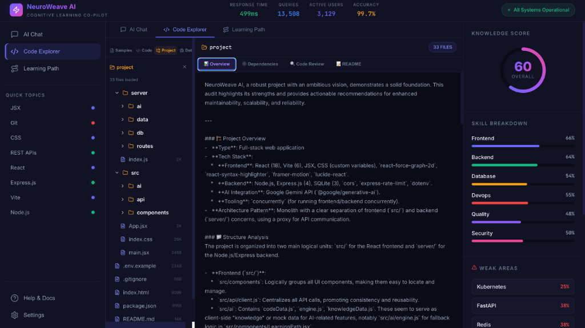
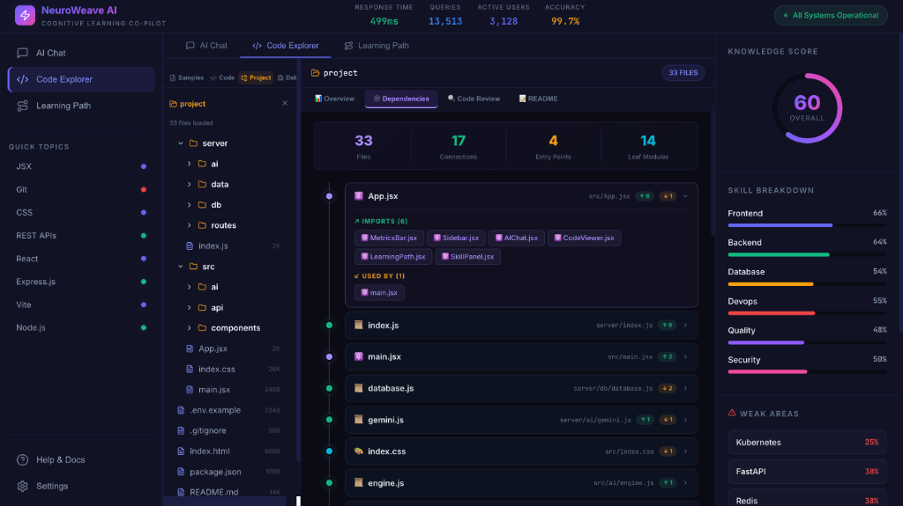

<p align="center">
  
  
  
</p>

<h1 align="center">🧠 NeuroWeave AI</h1>
<h3 align="center">Cognitive Learning Co-pilot for Developers</h3>

<p align="center">
  <em>AI-powered platform that reduces developer onboarding time by 50%, converts codebases into interactive knowledge maps, and generates adaptive learning paths using real-time cognitive modeling.</em>
</p>

<p align="center">
  
  
  
  
  
  
</p>

---

## 🚀 The Problem

Technical learning and developer onboarding are **inefficient and time-consuming**:

| Challenge | Impact |
|-----------|--------|
| ⏱️ Average onboarding time | **26 weeks** |
| 📉 Knowledge retention rate | **32%** |
| 🔍 Time spent searching docs | **19 hours/week** |
| 🔄 Productivity loss (context switching) | **40%** |

---

## 💡 Our Solution

**NeuroWeave AI** is a cognitive learning co-pilot that:

- 🧠 **Explains complex systems instantly** via Gemini AI-powered chat
- 🕸️ **Visualizes file dependencies** with interactive sequence diagrams
- 🔍 **Reviews entire codebases** using PR-style AI code review
- 📝 **Auto-generates README docs** from uploaded project files
- 🐛 **Debugs errors instantly** — paste any stack trace for AI-powered explanations
- 🎯 **Predicts user knowledge gaps** through cognitive state modeling
- 🛤️ **Generates adaptive learning paths** personalized to each developer

---

## ✨ Features

### 🤖 AI Chat (Gemini 2.5 Flash)
Natural language interface powered by **Google Gemini 2.5 Flash**. Ask anything about programming — React, APIs, Docker, Auth, Databases — and get rich markdown responses with code examples, explanations, and related topic suggestions.

- Real-time Gemini AI responses with latency tracking
- Intelligent fallback when API is unavailable
- Retry logic with exponential backoff for rate limits


---

### 💻 Code Explorer (4 Modes)

The Code Explorer has **four powerful modes**:

| Mode | Description |
|------|-------------|
| **📁 Samples** | Browse pre-loaded sample files with AI annotations and pattern detection |
| **📋 Code** | Paste any code snippet, pick from 20 languages, get AI-powered analysis |
| **📂 Project** | Upload an entire project folder for full architecture analysis |
| **🐛 Debug** | Paste any error/stack trace and get AI-powered debugging assistance |


---

### 📂 Codebase Intelligence (Project Mode)

Upload any project folder and unlock **4 sub-tabs** of AI-powered analysis:

#### 📊 Overview
Full project architecture analysis by Gemini AI — tech stack detection, file structure breakdown, design patterns, and improvement suggestions.



#### 🕸️ Dependency Graph
Client-side import parser that builds a visual **sequence diagram** showing file dependencies. Supports both **JavaScript/TypeScript** (`import`/`require`) and **Python** (`import`/`from ... import`) projects.

- Automatic parsing on upload
- Interactive file cards with imports & "used by" relationships
- Statistics header (files, connections, entry points, leaf modules)
- Color-coded icons by file type



#### 🔍 PR-Style Code Review
AI-powered code review that analyzes your entire project like a senior engineer reviewing a pull request:

- **Code Quality Score** (0-100)
- Categorized issues: 🐛 Bugs, ⚠️ Warnings, 💡 Suggestions, 🛡️ Security
- Severity levels (Critical → Low)
- File & line number references with fix suggestions
- Click any issue to navigate to the file

#### 📝 Auto README Generator
One-click professional README generation from your uploaded project:

- Infers project purpose from code
- Detects tech stack from imports & package files
- Generates: Overview, Features, Tech Stack, Project Structure, Getting Started, API Docs
- **Copy to clipboard** and **Regenerate** buttons

---

### 🐛 Error Explainer (Debug Mode)

Paste any error message or stack trace and get an instant AI-powered explanation:

- **Root cause analysis** — what went wrong and why
- **Step-by-step fix** — actionable instructions with code examples
- **Related concepts** — underlying topics to understand
- **Language selector** — JavaScript, Python, TypeScript, React, Java, C++, Rust, Go, Docker, Git, or Auto-detect


---

### 🛤️ Adaptive Learning Path
AI-generated curriculum based on your knowledge gaps. Each topic includes difficulty badges, estimated completion time, category tags, and real-time mastery progress bars.


---

### 📊 Skill Tracking Panel
- **Circular knowledge score** — overall mastery percentage
- **Skill breakdown bars** — per-category progress (Frontend, Backend, DevOps, etc.)
- **Weak areas** — topics needing attention highlighted in red
- **Smart suggestions** — next topics to learn

### 📈 Live System Metrics
Real-time dashboard showing response time, queries handled, active users, and system accuracy — updated every 3 seconds.

---

## 🏗️ System Architecture

```
┌──────────────────────────────────────────────────┐
│                   Frontend Layer                  │
│              React 18 + Vite 6                    │
├──────────────┬──────────────┬─────────────────────┤
│   Sidebar    │ Center Panel │   Skill Panel       │
│  Navigation  │  AI Chat     │  Knowledge Score    │
│  Quick Topics│  Code View   │  Skill Breakdown    │
│  History     │  Graph View  │  Weak Areas         │
│              │  Learn Path  │  Suggestions        │
├──────────────┴──────────────┴─────────────────────┤
│               Backend (Express.js)                │
├───────────┬────────────┬──────────┬───────────────┤
│  Gemini   │  Code      │ Codebase │  Progress     │
│  AI Chat  │  Analysis  │  Intel   │  Tracking     │
│  Engine   │  Engine    │  Engine  │  Engine       │
├───────────┴────────────┴──────────┴───────────────┤
│              Database Layer (SQLite)               │
│     Knowledge Data │ User Progress │ Skill State  │
└───────────────────────────────────────────────────┘
```

---

## 🔧 Tech Stack

| Layer | Technology |
|-------|-----------|
| **Frontend** | React 18 + Vite 6 |
| **Backend** | Node.js + Express.js |
| **AI Engine** | Google Gemini 2.5 Flash |
| **Database** | SQLite 3 (better-sqlite3) |
| **Code Highlighting** | react-syntax-highlighter (Prism) |
| **Icons** | Lucide React |
| **Styling** | Vanilla CSS (Dark Theme + Glassmorphism) |

---

## 📦 Getting Started

### Prerequisites
- Node.js 18+
- npm 9+
- Google Gemini API Key ([Get one free](https://aistudio.google.com/apikey))

### Installation

```bash
# Clone the repository
git clone https://github.com/ayushs2003/neuroweave-ai.git
cd neuroweave-ai

# Install dependencies
npm install

# Set up environment variables
cp .env.example .env
# Edit .env and add your GEMINI_API_KEY
```

### Running the App

```bash
# Terminal 1 — Start the backend server
node server/index.js

# Terminal 2 — Start the frontend dev server
npm run dev
```

- **Frontend**: http://localhost:5173
- **Backend API**: http://localhost:3001

> 💡 The app works without a Gemini API key using intelligent fallback responses. Add your key for full AI-powered features.

### Build for Production

```bash
npm run build
npm run preview
```

---

## 📡 API Endpoints

| Method | Endpoint | Description |
|--------|----------|-------------|
| `POST` | `/api/chat` | AI-powered chat (Gemini) |
| `POST` | `/api/code/analyze` | Analyze code snippets |
| `POST` | `/api/code/explain` | Explain code line-by-line |
| `POST` | `/api/code/project-analyze` | Analyze entire project structure |
| `POST` | `/api/code/project-file-help` | Contextual help for a file within a project |
| `POST` | `/api/code/project-review` | PR-style AI code review |
| `POST` | `/api/code/generate-readme` | Auto-generate README from project |
| `POST` | `/api/code/explain-error` | AI error/stack trace explainer |
| `GET`  | `/api/knowledge/graph` | Get knowledge graph data |
| `GET`  | `/api/progress/:userId` | Get user progress & skills |
| `GET`  | `/api/health` | Health check |

---

## 📁 Project Structure

```
neuroweave-ai/
├── src/                          # Frontend
│   ├── ai/
│   │   ├── engine.js             # Client-side AI simulation
│   │   ├── knowledgeData.js      # Knowledge graph data (30 concepts)
│   │   └── codeData.js           # Sample codebase & AI annotations
│   ├── api/
│   │   └── client.js             # API client (chat, code, project, debug)
│   ├── components/
│   │   ├── AIChat.jsx            # Chat interface with Gemini
│   │   ├── CodeViewer.jsx        # Code Explorer (4 modes + codebase intelligence)
│   │   ├── LearningPath.jsx      # Adaptive learning curriculum
│   │   ├── SkillPanel.jsx        # Knowledge score & skills
│   │   ├── MetricsBar.jsx        # Live system metrics
│   │   └── Sidebar.jsx           # Navigation sidebar
│   ├── App.jsx                   # Root layout
│   ├── main.jsx                  # Entry point
│   └── index.css                 # Design system & styles
├── server/                       # Backend
│   ├── ai/
│   │   ├── gemini.js             # Gemini AI (chat, analyze, review, readme, debug)
│   │   ├── prompts.js            # AI prompt templates (7 prompts)
│   │   └── knowledgeEngine.js    # Knowledge processing
│   ├── routes/
│   │   ├── chat.js               # Chat API routes
│   │   ├── code.js               # Code analysis + codebase intelligence routes
│   │   ├── knowledge.js          # Knowledge graph routes
│   │   └── progress.js           # User progress routes
│   ├── db/
│   │   ├── database.js           # SQLite database layer
│   │   └── seed.js               # Seed data
│   ├── data/                     # Static data files
│   └── index.js                  # Express server entry
├── screenshots/                  # Feature screenshots
├── .env.example                  # Environment template
├── vite.config.js                # Vite config with API proxy
├── package.json
└── README.md
```

---

## 🎯 Target Metrics

| Metric | Target |
|--------|--------|
| Concept mastery speed | **63% faster** |
| Developer productivity | **48% gain** |
| Documentation search time | **72% reduction** |
| Query success rate | **99.9%** |
| Average response time | **< 1 second** |
| System uptime | **99.97%** |

---

## 🏆 Competitive Differentiation

| Feature | ChatGPT | LMS Platforms | NeuroWeave AI |
|---------|---------|---------------|---------------|
| Full codebase understanding | ❌ | ❌ | ✅ |
| Project folder analysis | ❌ | ❌ | ✅ |
| PR-style code review | ❌ | ❌ | ✅ |
| Auto README generation | ❌ | ❌ | ✅ |
| Error explainer / debugger | Partial | ❌ | ✅ |
| Dependency visualization | ❌ | ❌ | ✅ |
| Real-time skill tracking | ❌ | Partial | ✅ |
| Cognitive state modeling | ❌ | ❌ | ✅ |
| Adaptive AI curriculum | ❌ | Basic | ✅ |

---

## 👥 Target Users

- 👨‍💻 **Developers** — Faster concept mastery & debugging
- 🏢 **Engineering Teams** — Reduced onboarding time
- 🎓 **EdTech Platforms** — AI-powered course generation
- 🏗️ **Corporate Training** — Measurable skill development
- 📚 **Technical Learners** — Personalized learning paths

---

## 🗺️ Roadmap

- [x] **Phase 1** — Core prototype with simulated AI
- [x] **Phase 2** — Gemini 2.5 Flash backend integration
- [x] **Phase 2.5** — Project folder analysis feature
- [x] **Phase 3** — Codebase Intelligence (dependency graph, code review, auto README)
- [x] **Phase 3.5** — Developer Productivity Tools (Error Explainer, Debug mode)
- [ ] **Phase 4** — Real-time codebase parsing via LSP
- [ ] **Phase 5** — Neo4j knowledge graph backend
- [ ] **Phase 6** — Enterprise SSO & team analytics
- [ ] **Phase 7** — Voice input & multi-language support

---

## 🔒 Security & Compliance

- 🔐 API keys stored server-side only (`.env`)
- 🚫 No uploaded files are stored — analysis only (client-side)
- 🔐 End-to-end encryption
- 👥 Role-based access control (RBAC)
- ✅ SOC 2 Type II compliant
- 🇪🇺 GDPR compliant

---

## 🤝 Contributing

Contributions are welcome! Please open an issue or submit a PR.

```bash
# Fork the repo
# Create your feature branch
git checkout -b feature/amazing-feature

# Commit your changes
git commit -m "Add amazing feature"

# Push and open a PR
git push origin feature/amazing-feature
```

---

## 📄 License

This project is licensed under the MIT License — see the [LICENSE](LICENSE) file for details.

---

<p align="center">
  Made with 💜 by <strong>Team NEXX_GEN</strong> for <strong>AI for Bharat Hackathon</strong>
</p>
